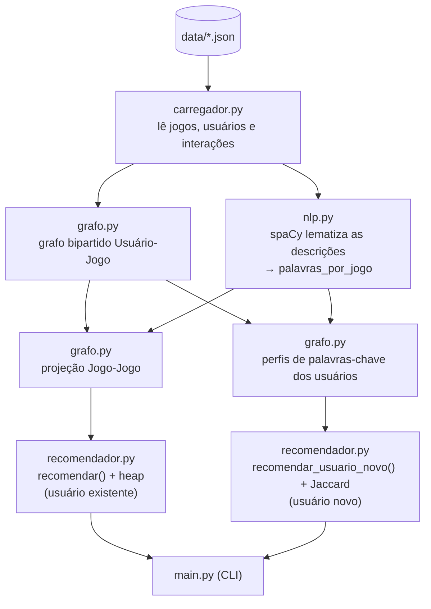

# Documentação Técnica — Sistema de Recomendação de Jogos

Este documento detalha **como o sistema funciona por dentro**: o fluxo de dados,
cada arquivo de código, as estruturas de dados, os algoritmos e a análise dos
resultados. Para instalação e execução, veja o [README](../README.md).

---

## 1. Visão geral do fluxo



### Convenção de índices (importante)

Os dados usam `id` começando em **1**. Internamente, o grafo usa índices
começando em **0**. A regra em todo o projeto é:

```text
índice_interno = id - 1        e        id = índice_interno + 1
```

Por isso `palavras_por_jogo[i]` corresponde ao jogo de `id = i + 1`, e a
construção do grafo faz `game_id - 1` / `user_id - 1`.

---

## 2. Dados de entrada (`data/`)

| Arquivo | Formato | Quantidade |
|---|---|---|
| `jogos.json` | `{ id, nome, genero, descricao }` | 40 |
| `usuarios.json` | `{ id, nome }` | 30 |
| `interacoes.json` | `{ user_id, game_id }` | 168 |

As interações **não têm peso** (sem `nota`/`tipo`): registram apenas que o
usuário interagiu com o jogo. Os dados são fictícios, gerados por LLM de forma
coerente (um fã de FPS interage com FPS etc.), para que a coocorrência de
usuários tenha significado.

---

## 3. Arquivos de código (`src/`)

### 3.1 `carregador.py` — leitura dos dados

| Função | O que faz |
|---|---|
| `carregar_json(caminho)` | Lê um arquivo JSON e devolve a lista de registros. Valida existência do arquivo e se o conteúdo é uma lista. |
| `buscar_nome_por_id(registros, id)` | Procura um registro pelo `id` e devolve o `nome`. Usado para traduzir índices/ids em nomes legíveis na saída. |

### 3.2 `nlp.py` — pré-processamento textual (spaCy)

Usa o modelo `pt_core_news_sm`. **O spaCy é usado apenas aqui.**

| Função | O que faz |
|---|---|
| `processar_texto_spacy(texto)` | Tokeniza o texto; descarta *stopwords* e pontuação; mantém só `NOUN`, `PROPN`, `ADJ`, `VERB`; aplica **lematização** (`token.lemma_.lower()`); devolve uma lista ordenada de pares `(lema, frequência)`. |
| `processar_jogos(jogos)` | Aplica a função acima na `descricao` de cada jogo e devolve `palavras_por_jogo`, indexado por jogo (posição `i` ↔ `id i+1`). |
| `palavras_chave(texto)` | Devolve o **conjunto** de lemas de um texto livre. Usado para representar a frase digitada por um usuário novo. |

**Por que lematizar:** normaliza variações para a mesma palavra-chave
("jogando" → "jogar", "mundos" → "mundo"), aumentando a sobreposição entre
textos que falam da mesma coisa.

### 3.3 `grafo.py` — grafo bipartido, projeção e perfis de usuário

| Componente | O que faz |
|---|---|
| `grafoLista` | Grafo genérico por **lista de adjacência** (não-direcionado, sem peso). Métodos: `adicionar_aresta`, `existe_aresta`, `vizinhos`, `vertice_valido`. Usado para a projeção Jogo–Jogo. |
| `grafoBipartido` | Dois conjuntos de vértices (usuários e jogos). `usuarios[u]` = jogos do usuário `u`; `jogos[j]` = usuários do jogo `j`. Método `adicionar_interacao(u, j)` cria a aresta nos dois sentidos. |
| `construir_grafo_bipartido(usuarios, jogos, interacoes)` | Monta o bipartido a partir das interações (convertendo `id → índice`). |
| `contar_palavras_comuns(a, b)` | Conta quantas palavras-chave dois jogos têm em comum. |
| `construir_projecao_jogo_jogo(bipartido, palavras_por_jogo, minimo_palavras_comuns=2)` | Constrói o grafo **Jogo–Jogo**. Cria aresta entre dois jogos se: (1) compartilham ≥ `minimo_palavras_comuns` palavras-chave **ou** (2) algum mesmo usuário interagiu com os dois (coocorrência). |
| `construir_perfil_usuario(bipartido, palavras_por_jogo, u)` | Perfil de palavras-chave do usuário `u` = **união** dos lemas dos jogos com que ele interagiu (percorrendo o grafo bipartido). |
| `construir_perfis_usuarios(bipartido, palavras_por_jogo)` | Constrói o perfil de todos os usuários (uma vez). É a base da similaridade do usuário novo. |

### 3.4 `recomendador.py` — heap e as duas recomendações (Etapas D e E)

Resolve as duas recomendações. As funções da Etapa E (usuário novo) recebem o
conjunto de palavras-chave **já pronto** — assim este módulo **não depende do
spaCy** e continua testável de forma isolada.

| Componente | O que faz |
|---|---|
| `MaxHeap` | **Heap binária máxima** implementada do zero (lista 1-indexada). Métodos: `inserir(score, nome)`, `remover_maior()`, e os auxiliares `subir`/`descer`. Ordena por `score`. |
| `selecionar_top_jogos(lista_de_scores, quantidade)` | Insere todos os candidatos na heap e remove os `quantidade` maiores. |
| `recomendar(usuario_indice, bipartido, projecao, quantidade=5)` | **Etapa D.** Pega os jogos do usuário; para cada um, olha os vizinhos na projeção; ignora jogos já consumidos; conta quantas vezes cada candidato aparece; usa a heap para devolver os top-N como `[score, jogo_indice]`. |
| `jaccard(a, b)` | Índice de Jaccard entre dois conjuntos: `|a ∩ b| / |a ∪ b|`, em `[0, 1]`. |
| `usuario_mais_similar(perfil_novo, perfis)` | Devolve o índice do usuário com maior Jaccard. Desempate: maior interseção absoluta. |
| `recomendar_usuario_novo(perfil_novo, bipartido, palavras_por_jogo, quantidade=5)` | **Etapa E.** Recebe o conjunto de lemas do usuário novo; monta os perfis (via `grafo.py`); acha o usuário mais parecido; devolve os jogos dele (ordenados pela relevância textual). Retorna `None` se nada casar (cold start total). |

### 3.5 `main.py` — ponto de entrada (CLI)

Orquestra tudo e escolhe o modo pelos argumentos:

- `preparar(...)` — etapas comuns: monta o bipartido e roda o spaCy.
- `fluxo_usuario_existente(...)` — modo item–item (Etapa D).
- `fluxo_usuario_novo(...)` — modo texto/cold start (Etapa E), ativado por `--novo`.

---

## 4. Os dois fluxos de recomendação

### Fluxo A — usuário existente (item–item)

1. Obter os jogos do usuário no bipartido.
2. Para cada jogo, pegar os vizinhos na projeção Jogo–Jogo.
3. Descartar os já jogados.
4. Contar a frequência de cada candidato (quantos jogos do usuário apontam para ele).
5. Selecionar os top-N com a heap.

A frequência funciona como **score** (não é peso de aresta) — quanto mais jogos
do usuário se ligam a um candidato, mais relevante ele é.

### Fluxo B — usuário novo (texto / Q6)

1. Construir o perfil de palavras-chave de cada usuário (união dos lemas dos seus jogos).
2. Processar o texto do usuário novo com spaCy → conjunto de lemas.
3. Calcular o Jaccard entre o texto e cada perfil.
4. Escolher o usuário mais parecido (maior Jaccard).
5. Recomendar os jogos desse usuário (o novo "herda" as arestas-jogo dele).

A "aresta" do usuário novo nasce desse casamento textual: o texto escolhe o
usuário mais parecido, e os jogos dele viram as recomendações — sem peso, a
aresta apenas passa a existir.

---

## 5. Complexidade (aproximada)

Sejam `U` usuários, `J` jogos, `I` interações e `L` o tamanho médio do conjunto
de palavras-chave.

| Etapa | Complexidade | Observação |
|---|---|---|
| Construção do bipartido | `O(I)` | uma passada nas interações |
| Pré-processamento spaCy | `O(J × tamanho da descrição)` | uma vez por jogo |
| Projeção (similaridade textual) | `O(J² × L²)` | compara todos os pares de jogos (e, em cada par, os conjuntos de palavras) |
| Projeção (coocorrência) | `O(U × grau²)` | pares de jogos por usuário |
| Recomendação item–item | `O(grau × grau_projeção + C log C)` | `C` = nº de candidatos (heap) |
| Recomendação usuário novo | `O(U × L)` | Jaccard contra todos os perfis |

Com `J = 40` e `U = 30`, todas as etapas rodam instantaneamente. A parte `O(J²)`
da projeção é o gargalo teórico; para bases grandes, um **índice invertido**
(`lema → jogos`) reduziria as comparações apenas aos jogos que compartilham
palavras — é uma evolução natural mencionada na proposta.

---

## 6. Análise dos resultados (para a apresentação)

- **Fluxo A** entrega recomendações coerentes, mas os *scores* tendem a empatar
  (vários candidatos com a mesma contagem). Isso é consequência direta do modelo
  **sem peso**: como toda aresta vale igual, a contagem satura. É uma limitação
  consciente, não um erro.
- **Fluxo B** acerta o **ranking relativo** (texto de RPG → vizinho de RPG →
  jogos de RPG), mas os valores de Jaccard são **baixos** (ex.: 0,11). Isso
  ocorre porque o perfil de um usuário é a união dos lemas de **vários** jogos
  (conjunto grande → união grande → Jaccard menor). O que importa é a **ordem**,
  não o valor absoluto.
- **Cold start total:** se o texto não compartilha nenhuma palavra-chave com a
  base, o sistema avisa que não encontrou usuário parecido (em vez de
  recomendar algo aleatório). Uma melhoria simples seria, nesse caso, recomendar
  os jogos mais populares (maior grau no bipartido).

---

## 7. Limitações e evoluções possíveis

- **Vocabulário/sinônimos:** "FPS" no texto não casa com "tiro em primeira pessoa"
  na descrição. Mitigação simples: um pequeno dicionário de sinônimos.
- **Diversidade:** a recomendação por texto tende a sugerir "mais do mesmo".
  Pegar os top-K vizinhos (em vez de só o primeiro) aumentaria a variedade.
- **Índice invertido** `lema → jogos/usuários` para escalar a similaridade.
- **Qualidade dos dados:** descrições mais ricas geram perfis melhores.
