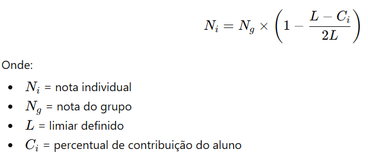

# Informações sobre o Trabalho

FGA0030 - ESTRUTURAS DE DADOS 2 - Turma 03 - 2026/1

## Regras:
1. As temáticas dos trabalhos estão relacionadas ao Processamento de Linguagem Natural (PLN).
2. Cada grupo poderá escolher livremente uma área de aplicação para o problema abordado, por exemplo, área médica, educação, segurança pública, mercado financeiro, jurídico, esportes, entre outras, desde que o problema abordado tenha dados textuais como entrada, tais como frases, documentos, comentários, prontuários, notícias, avaliações, mensagens, artigos, etc. 
3. Os dados utilizados no projeto poderão ser reais ou fictícios. Os dados fictícios poderão ser gerados com auxílio de modelos de linguagem (LLMs), desde que sejam coerentes com a área de aplicação escolhida.
4. Os trabalhos deverão ser implementados utilizando obrigatoriamente as linguagens C/C++ ou Python.
5. O trabalho deverá envolver obrigatoriamente o uso de Grafos e pelo menos uma outra estrutura de dados em alguma etapa da solução.
6. O trabalho deverá apresentar alguma análise ou interpretação dos resultados obtidos.
7. É permitido utilizar bibliotecas externas para PLN, desde que a modelagem em grafos e os algoritmos principais sejam implementados pelo grupo.
8. O código-fonte deverá estar hospedado no GitHub de pelo menos um integrante do grupo e a última atualização do repositório no GitHub deverá ocorrer até o dia 22/06/2026.
9. Além do código-fonte, cada grupo também deverá entregar uma apresentação final (slides powerpoint - sem limite de slides) contendo a seguinte estrutura:
    - descrição do problema;
    - modelagem do grafo;
    - descrição da solução;
    - implementação;
    - exemplos de entrada e saída;
    - análise dos resultados;
    - incluir um slide indicando como LLM foi utilizado no desenvolvimento do trabalho.
10. Trabalhos semelhantes entre grupos não serão permitidos, mesmo que utilizem bases de dados diferentes. A falta de originalidade será um critério de penalização na avaliação.

## Critérios de avaliação
| Critério | Descrição | Pontuação |
|----------|-----------|-----------|
| 1. Definição do Problema | Clareza na descrição do problema de PLN, contextualização da área de aplicação e coerência dos objetivos do trabalho. | 0,5 |
| 2. Qualidade e Coerência dos Dados | Adequação dos dados utilizados ao problema proposto. Organização e representação dos dados textuais. Coerência dos dados fictícios gerados por LLMs (se houver). | 1,0 |
| 3. Implementação da Solução | Qualidade da implementação em C/C++ ou Python. Funcionamento correto do sistema. Organização, modularização e legibilidade do código. Uso adequado de pelo menos uma estrutura de dados adicional além do grafo. Justificativa técnica da escolha. Correta definição dos vértices, arestas, pesos, relações e representação do grafo. Complexidade e adequação da modelagem ao problema. Correção adequação dos algoritmos implementados para a solução do problema. | 3,5 |
| 4. Algoritmos em Grafos | Implementação dos principais algoritmos em grafos pelo próprio grupo sem utilização de bibliotecas prontas. Aplicação correta ao problema proposto. | 2,0 |
| 5. Análise e Interpretação dos Resultados | Capacidade de interpretar e justificar os resultados obtidos. Discussão sobre padrões, relações, agrupamentos, similaridades, métricas ou conclusões extraídas. | 2,0 |
| 6. Apresentação Final | Clareza e organização da apresentação. Presença obrigatória dos itens solicitados: problema, modelagem, solução, implementação, exemplos de entrada/saída; análise dos resultados e indicação explícita do uso de LLM. Clara definição da contribuição de todos os integrantes do grupo. | 1,0 |
| **Total** | | **10,0** |
 
A nota do trabalho será inicialmente atribuída ao grupo como um todo. **Após a apresentação, cada integrante irá avaliar os outros membro do grupo informando o percentual de contribuição de cada integrante no desenvolvimento do trabalho.** A contribuição final de um membro do grupo será a média atribuida pelos outros integrantes.

Após todos os grupos apresentarem, os professores irão definir um percentual mínimo esperado de contribuição individual, ou seja, um limiar L. Se o aluno ficar acima desse limiar L, então ele receberá a nota integral do trabalho, se ficar abaixo, então a nota desse aluno será dada pela fórmula:

 
## Penalizações na nota do grupo

| Situação | Penalização |
|----------|-------------|
| Trabalho sem uso de grafos | Nota zero |
| Trabalho sem outra estrutura de dados além do grafo | -5,0 |
| Uso de bibliotecas prontas para algoritmos principais de grafos | -5,0 |
| Código-fonte não disponível no GitHub | Nota zero |
| Última atualização do código no GitHub após 22/06/2026 | -2,0 por dia de atraso |
| Ausência da apresentação final | Nota zero |
| Projeto não relacionado a PLN | Nota zero |
| Código não executa ou possui falhas graves | Nota zero |
| Trabalho similar a outro grupo (inclusive de outra turma) | -5,0 |
| Cópia de implementação de outro grupo | Nota zero |
 
## Temáticas dos Trabalho
A escolha das temáticas serão definidas por sorteio em sala de aula.

Para qualquer temática é necessário: 

1. definir um problema
2. definr uma solução (quais algoritmos e estruturas de dados utilizar)
3. indicar se a solução proposta resolveu o problema

| Código | Dia de Apresentação | Objetivo |
|--------|---------------------|----------|
| B | 01/07/2026 | Implementar um sistema de recomendação de textos. Dada uma coleção de textos e um conjunto de interações de usuários, construa um grafo bipartido usuário-texto, onde os vértices representam usuários e documentos textuais, e as arestas representam interações entre usuários e os textos, por exemplo, leitura, avaliação, interesse, compartilhamento, etc. A partir desse grafo, gere projeções texto-texto utilizando medidas de similaridade semântica e/ou relações de coocorrência de usuários, ou qualquer outra medida que achar interessante. Utilize pesos nas arestas, aplique técnicas de filtragem e desenvolva mecanismos de recomendação capazes de sugerir textos relevantes para cada usuário. |